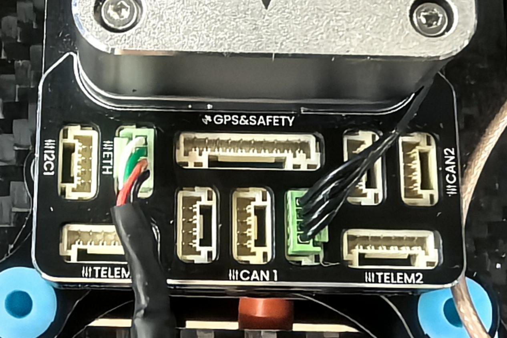
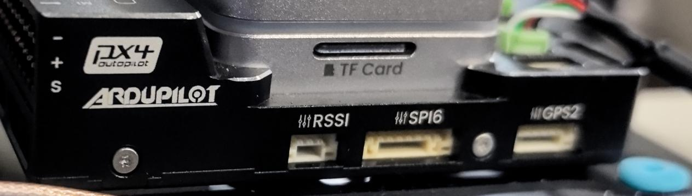
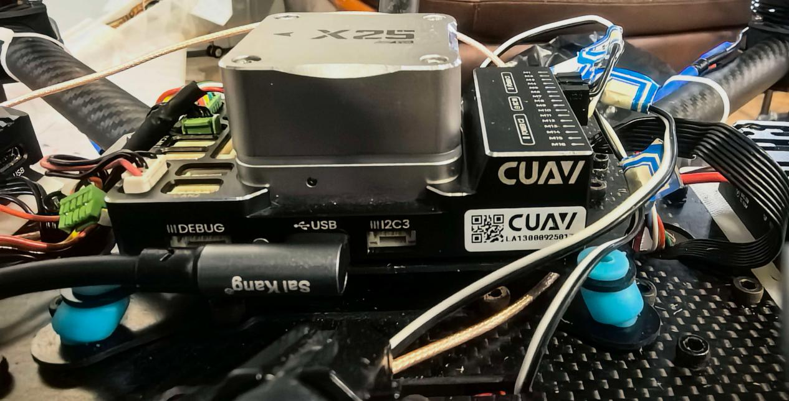
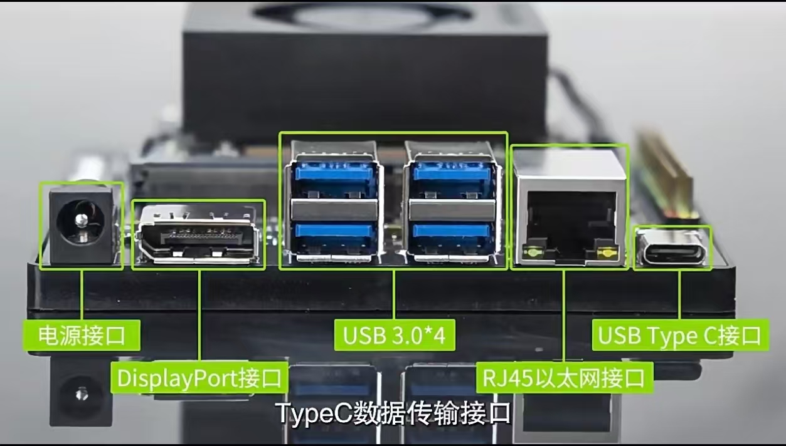
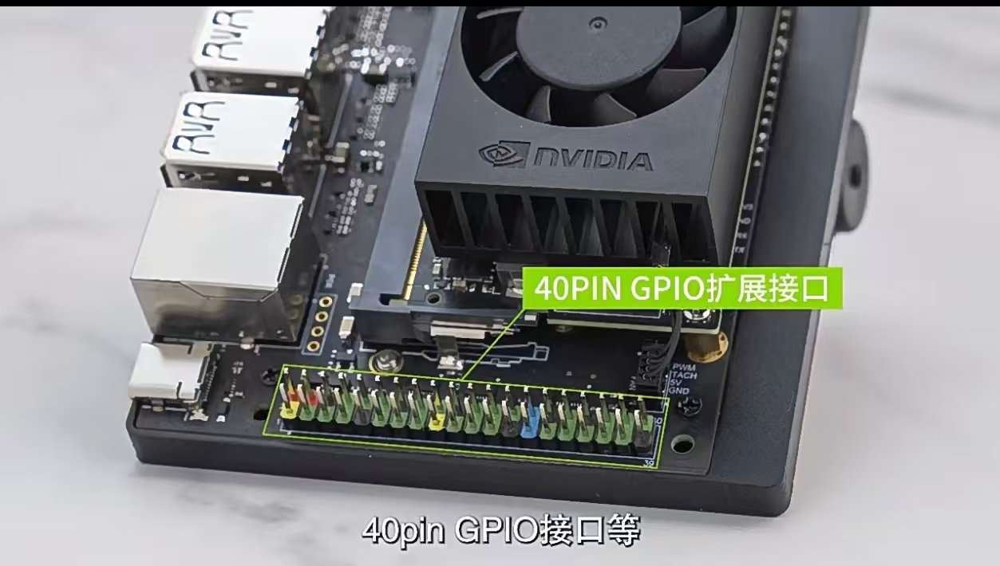
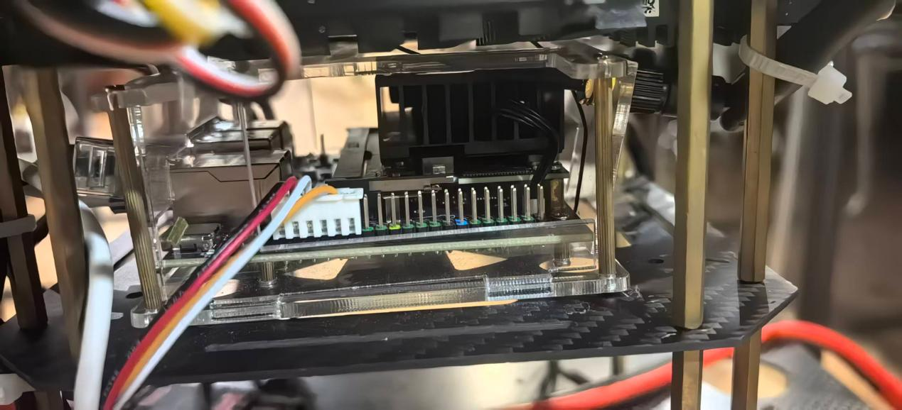
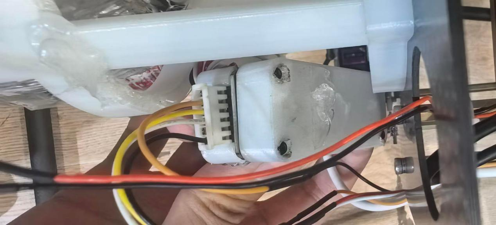
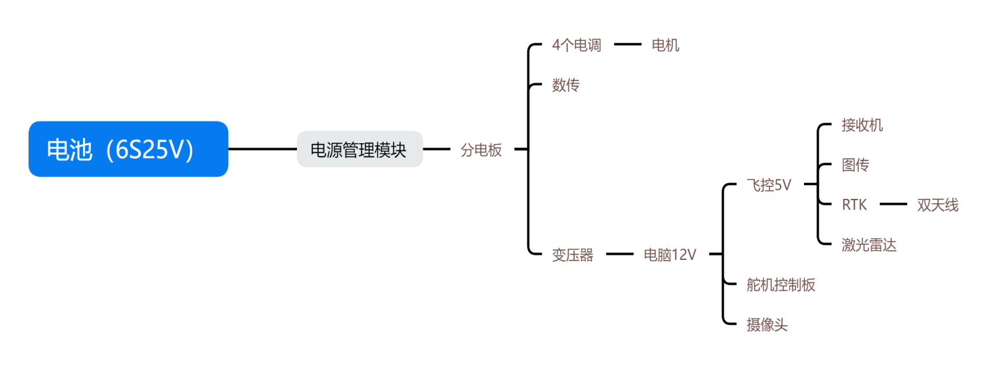

# 多旋翼接线

## 一、飞控CUAV X25 EVO

- 

### 1. \* I2C1

- 标准用途：I2C总线扩展口，外接低速外设

- 常用：外置电子罗盘（C-COMPASS）、蜂鸣器、状态LED灯、TFmini激光雷达、温湿度传感器

### 2.ETH

**接电脑（网线）**

- （以太网口，绿色插座，插了红黑白绿排线）

- 标准用途：千兆高速网口

- 对接Jetson Xavier/Nano、树莓派等机载计算机，高速传输MAVLink、机器视觉图传、大日志文件，带宽远高于串口TELEM

- 实拍：已经接线，另一端连接机载算力板，用于高速通信

### 3.\*GPS & SAFETY

- 标准用途：整机定位+安全开关总接口

- 标配接入：普通GPS/RTK模块、安全解锁开关、飞行状态指示灯、蜂鸣器

- 集成GPS串口、安全按钮电路，是整机定位系统的主入口

### 4.TELEM1

**接数传**

- （第一路遥测串口）

- 标准用途：SERIAL1，默认接远距离无线数传电台（433M/915M）

- 用来和地面站QGC通信，室外飞行实时查看姿态、日志、手动遥控飞机

- PX4默认MAVLink协议，常规波特率57600/115200

### 5.CAN1

**接RTK**

- （绿色插座）

- 标准用途：DroneCAN总线一号通道

- 接CAN协议外设：CUAV NEO4 SE CAN-RTK高精度GPS、CAN电调、云台、功率模块、避障雷达

- 工业无人机首选总线，支持多设备挂载、长距离稳定通信

### 6.TELEM2

**接激光雷达**

- （第二路遥测串口，你之前重点问的接口）

- 标准用途：SERIAL2，Offboard自主控制核心口

- 专门对接机载电脑（Jetson），运行MAVROS、下发自主航线、执行任务调度，就是你GitHub Drone\_Task\_Controller 的核心通信接口

- PX4推荐配置：波特率921600、协议MAVLink2

### 7.\*CAN2

- 标准用途：DroneCAN二号备用通道

- 拓展第二组CAN外设：副GPS、云台、分布式动力单元、额外传感器

- 

- -：GND 地线

- +：5V 供电输出

### 8.S

- **接电调**

- 信号输入（PWM）

- 标准用途：

- 外接接收机RSSI模拟信号、外接蜂鸣器、安全开关、外部状态指示灯

- 也可以接入遥控器接收机的PWM单通道信号，读取遥控器档位

### 9.\*TF Card 卡槽

- （TF存储卡插槽）

- 插入Micro SD卡（TF卡）

- 核心作用：存储飞行日志、参数备份、离线任务文件、固件日志、崩溃dump文件

- PX4/ArduPilot都会把飞行记录存在这张卡里，后期用QGC分析飞行数据、排查炸机问题

### 10.\*RSSI 接口

- 全称 Receiver Signal Strength Indicator，接收机信号强度接口

- 主要用来接入遥控器接收机的 RSSI电压输出

- 飞控实时读取遥控器信号强弱，在地面站QGC里显示遥控信号质量、低信号报警

- 也可以外接模拟量传感器、外部按键触发信号

### 11.\*SPI6 接口

- SPI高速总线接口（编号SPI6）

- SPI属于高速同步总线，常用外接：

- 外置高速SPI闪存、SPI雷达、SPI OLED状态显示屏

- 外接外置磁罗盘、高速传感器拓展

- 工业场景用来挂载高速外设，不占用串口资源

### 12.\*GPS2 第二GPS接口

- 二号GPS串口，和正面的GPS&SAFETY主GPS相互独立

- 可以接第二台普通GPS模块、备用GPS、外置罗盘

- 适合双GPS冗余备份飞行（一套主定位、一套备用，提升可靠性）

- 也可以外接串口激光雷达、串口传感器，在固件里映射为额外串口

- 补充固件说明

- 机身同时印有 PX4 autopilot 和 ArduPilot，说明这款X25 EVO两种固件都支持刷写：

- 跑PX4：适合你的Offboard机载电脑自主任务、MAVROS开发

- 跑ArduPilot：更适合传统航模、复杂航迹、固定翼机型

### 13.POWER C1

- **接电源管理模块**

- 作用：接 PMU2 Lite 电源模块（DroneCAN 智能电源）

- 整机主供电、电池电压检测、电流检测、分电、给飞控整体供电都靠这里

- 必须插原厂PMU电源线，对接机架上的PMU电源板，接动力电池（6～16S）

### 14.M1 ~ M16

- **接电调**

- 全部是 PWM 输出通道，两种用法：

- 多旋翼（四轴/六轴/八轴）

- M1~M8 依次接电调ESC信号线，对应1～8号电机，机架构型（四轴X型、六轴等）决定电机顺序

- 剩余M9~M16可以接云台舵机、投放机构、起落架舵机、水泵、机械执行器

- 固定翼/VTOL垂起

- M1~M16接副翼、升降、方向舵、襟翼、推进电机等舵机/动力通道

- 注意：飞控本身不给舵机供电，大功率舵机需要外接BEC供电

### 15. RC IN

- **接收机专用接口**

- 接 SBUS / PPM / DSM 这类传统单向接收机（比如FrSky、Futaba SBUS接收机）

- ❌ CRSF、ELRS 高速接收机不要插这里，要插到侧边UART串口

### 16.\*POWER C2

- 第二路DroneCAN电源扩展口，和C1功能一致

- 双PMU冗余供电、外接大功率DroneCAN设备、扩展第二路电源监测

- 常规单机只用插 POWER C1 即可，冗余机型才用C2

- 

### 17.USB

- **接电脑（电脑给飞控供电）**

- 地面站QGC有线连接飞控，电脑直接识别串口，调试、刷固件、读取日志

- 起飞前参数配置、校准罗盘、加速度计、上传航点都靠它

- 飞行中有线连接可以替代数传，适合室内调试

### 18.\*DEBUG (DSU)

- 原厂用途：飞控内核调试、打印日志、工程师排查崩溃问题

- 日常装机（ArduPilot）：可以在参数里改成额外串口，不推荐主力使用，一般闲置

- 不建议接数传、吊舱，留给故障排查

## 19.电脑JETSON ORIN NX

## **接口详细说明（标\*为未使用）**

### **1.1 电源接口**

**连接变压器，变压器连接分电板**

**接口形式**：DC圆孔（5.5×2.5mm规格）

**输入电压**：**9-19V DC**

**建议电源**：12V/5A电源适配器

**功能**：为整个载板和核心模块供电

**部分工业级载板**可支持更宽电压范围，如9-36V DC

连接电源适配器后，电源指示灯应亮起，表示供电正常。

### **1.2 USB 3.0 × 4（Type-A）**

**其一：连接飞控的USB TypeC接口（第一架机上为左下方USB接口）**

**其二：连接摄像头（第一家机为右上方USB接口）**

**其三：连接舵机控制板（第一家机为右下方USB接口）**

**其四：左上方USB接口未使用**

**USB接口在物理上没有顺序划分，此处只是说明第一家机上的接口顺序。**

**接口类型**：标准USB Type-A（蓝色或黑色）

**数量**：**4个**

**规格**：USB 3.2 Type-A，支持**10Gbps**超高速数据传输

**向下兼容**：同时集成USB 2.0信号

**功能**：连接键盘、鼠标、U盘、USB摄像头、移动硬盘等外设

### **1.3 \*USB Type-C 接口**

**接口类型**：USB Type-C

**规格**：通常为**USB 2.0 Type-C**，部分载板为USB 3.0

**工作模式**：**Device Mode（设备模式）**

作为**OTG（On-The-Go）** 接口，连接主机设备进行数据传输

部分载板用于**系统烧录（Flashing）** 或**调试（Debug）**

**注意**：不同载板厂商对Type-C的定义可能略有差异，具体用途请参考载板丝印标注（如标有“OTG”、“DEBUG”或“Flashing”）。

### **1.4 \*Type-C 数据传输接口**

**接口类型**：USB Type-C（与上述Type-C可能为同一接口或独立接口，视具体载板设计而定）

**功能**：专门用于**数据传输**

部分载板会区分两个Type-C口的功能——一个用于数据/OTG，一个专用于恢复模式（Recovery）

建议查看载板表面的丝印文字确认具体功能。

### **1.5\* DisplayPort 接口（DP）**

**接口类型**：标准DisplayPort或Mini DisplayPort

**规格**：**DP 1.4a**

**支持特性**：

支持**多流传输（MST）**

最高分辨率可达**4K（3840×2160）**

**功能**：连接显示器、投影仪等显示设备，输出高清视频画面

**说明**：部分载板可能使用HDMI接口代替DP，具体以实物为准。DP接口支持更高刷新率和多显示器扩展。

### **1.6 RJ45 以太网接口**

**之前接飞控ETH接口，现在使用舵机控制板所以弃连。**

**接口类型**：标准RJ45

**规格**：**千兆以太网（10/100/1000Mbps）**

**功能**：连接有线网络，实现高速数据传输和网络通信

部分载板提供**双千兆以太网**配置

### **1.7 40-Pin GPIO 扩展接口**

排针连接舵机控制版，具体接线方式与顺序如上图所示

对于电脑来说，接线顺序为黑线连接橙线，橙线连接黑线，白线连接白线，红线连接黄线。

**接口类型**：两排共40个金属排针

**兼容性**：与**NVIDIA Jetson Orin Nano Developer Kit**引脚定义兼容

**支持协议**：

**GPIO**（通用输入输出）

**I2C**（Inter-Integrated Circuit）

**SPI**（Serial Peripheral Interface）

**UART**（通用异步收发传输器）

**I2S**（音频接口）

**PWM**（脉宽调制）

**功能**：连接各类传感器、执行器、LED、显示屏、扩展板等外部设备

部分载板采用**彩色排针**设计，便于区分不同功能的引脚

## **其他常见接口（以下未用到，只是常见接口）**

### **2.1 MIPI CSI 摄像头接口**

**接口类型**：FPC连接器（通常为15-pin或22-pin）

**通道配置**：常见为**2×4-lane**或**2×2-lane**

**功能**：连接MIPI CSI摄像头模组，用于图像/视频采集

### **2.2 M.2 扩展接口**

| 类型 | 规格 | 功能 |
| --- | --- | --- |
| **M.2 Key M** | 2280规格 | 安装**NVMe SSD固态硬盘** |
| **M.2 Key E** | 2230规格 | 安装**Wi-Fi/蓝牙无线网卡** |
| **M.2 Key B**（可选） | 3052规格 | 安装**4G/5G蜂窝通信模块** |

### **2.3 风扇接口**

**接口类型**：4-pin连接器

**规格**：**5V PWM**（脉宽调制调速）

**功能**：连接散热风扇，实现主动散热

### **2.4 控制按键**

**POWER键**：电源开关

**RESET键**：系统复位

**RECOVERY键**：恢复模式按键，用于系统烧录

### **2.5 串行通信接口**

**CAN**：控制器局域网络，用于工业控制和车载通信

**RS232 / RS485**：标准串行通信接口

**UART**：调试串口

### **2.6 RTC 接口**

**接口类型**：2-pin连接器

**功能**：连接外部纽扣电池（如CR1220），为实时时钟供电

### **2.7 指示灯**

**电源指示灯**：指示上电状态

## **技术规格汇总**

| 接口 | 规格 | 备注 |
| --- | --- | --- |
| 电源输入 | 9-19V DC（5.5×2.5mm） | 建议12V/5A |
| USB 3.0 Type-A | 4×USB 3.2（10Gbps） | 向下兼容USB 2.0 |
| USB Type-C | USB 2.0（Device Mode） | OTG/调试/烧录 |
| DisplayPort | DP 1.4a | 支持4K输出 |
| RJ45以太网 | 千兆（10/100/1000M） | — |
| 40-Pin GPIO | I2C/SPI/UART/I2S/PWM | 兼容Jetson标准 |
| MIPI CSI | 2×（2-lane或4-lane） | FPC连接器 |
| M.2 Key M | 2280 NVMe SSD | — |
| M.2 Key E | 2230 Wi-Fi/蓝牙 | — |
| 风扇接口 | 4-pin 5V PWM | — |
| 工作温度 | -10°C至60°C | 工业级可达-25°C至85°C |
| 尺寸 | 100mm×80mm（典型值） | 因厂商而异 |

## 供电问题

- 
