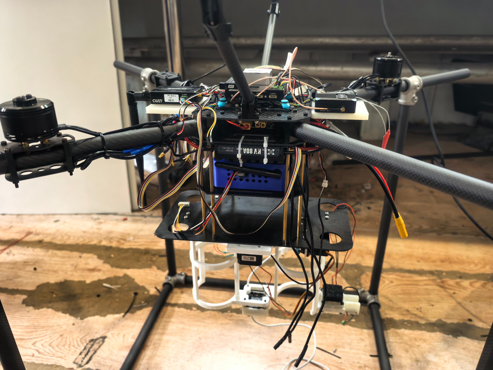
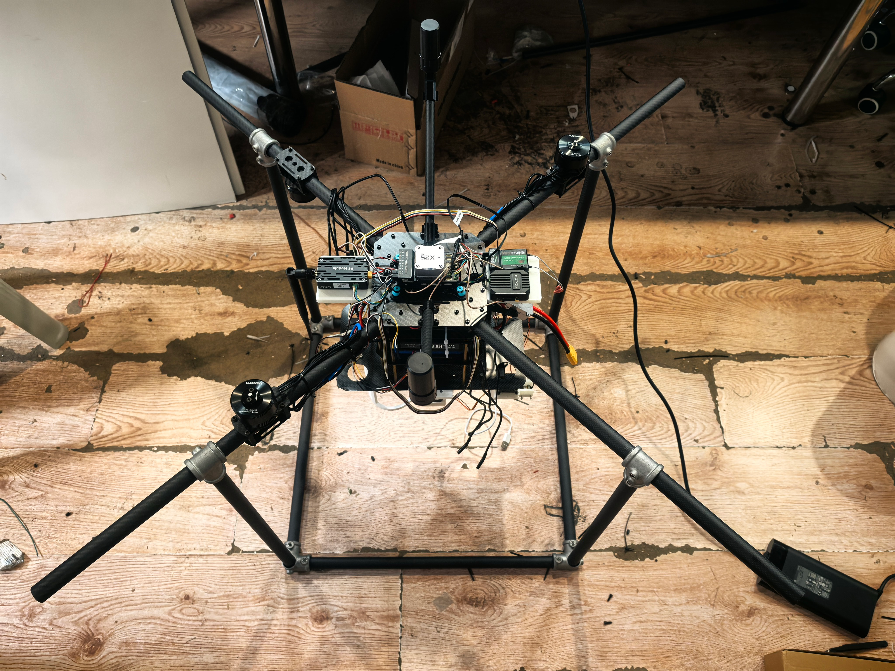
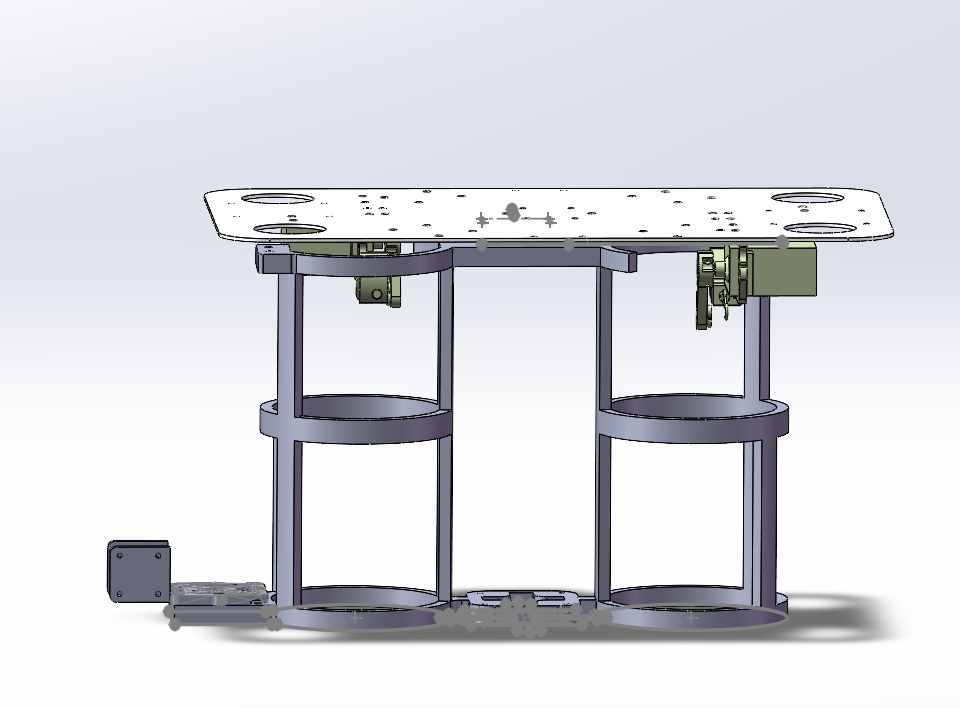
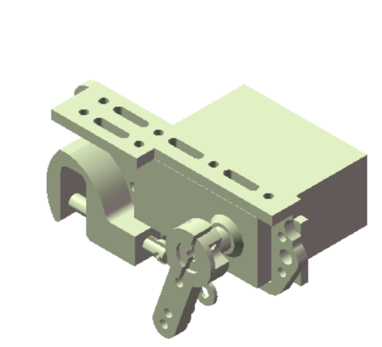
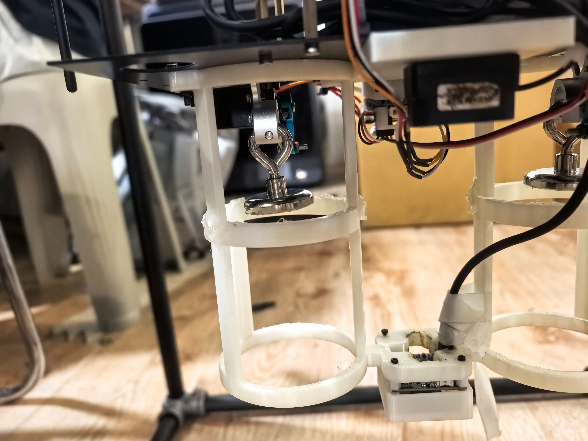
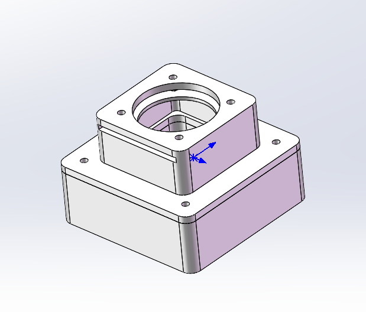

# 机体结构

## 一、整体外观

- 

### 结构分布（从上到下）
- 顶层：飞控、双天线、RTK、数传、接收机
- 碳板上层：分电板、管架、电源管理模块
- 碳板中层：电调、电脑
- 碳板下层：电池
- 上围板区域：舵机、舵机控制板、导向筒、激光雷达
- 前端区域：图传、摄像头、滤光片

## 二、机架

- 

### 1. 设计核心目的
本立方体框式防护机架专为小型四旋翼飞行器设计，核心作用是坠机、磕碰、地面倾倒时全方位保护机身、动力电机与螺旋桨，杜绝桨叶断裂、机臂变形、飞控元器件撞击损毁等故障，大幅降低试飞损耗。

### 2. 结构布局与防护原理
#### 外围立体框架防撞主体
机架由四根支出碳管+方形边框组成封闭立方体笼式结构，将整个四旋翼完全包裹在框架内部。

飞行器所有桨叶、机臂均不超出外框边界；飞行器意外坠地、侧翻、撞击墙面/地面时，框架立柱、边框率先接触障碍物，冲击力由管材框架承担，隔绝机身与硬质地面的直接碰撞。

四角接头做圆弧过渡，无尖锐棱角，避免二次剐蹭。

四旋翼机臂向外伸展、螺旋桨分布在机架中层空间，上下两层横杆形成上下限位防护：
- 飞行器横向倾倒侧摔：四周竖杆挡住桨叶，螺旋桨不会剐蹭地面、不会撞击硬质平面折断；
- 飞行剐蹭障碍物时，外框优先接触，桨叶完全收纳在框架内部，从根源避免桨叶磕碰碎裂。

#### 中部悬挂缓冲结构，保护机身核心部件
飞行器采用悬挂式安装于框架中心，机身与外框之间留有缓冲间隙，搭配弹簧减震结构：
- 坠机冲击发生时，弹簧吸收大部分撞击动能，缓冲传递至飞控、电池、电调、云台的冲击力，防止电路板脱焊、电池挤压破损；
- 机身悬浮居中，无论哪个方向撞击，机身都不会直接挤压外框硬接触，保护飞控等精密电子元件。

## 三、投放装置

- 
- 

### 1. 整体结构组成
本投放装置搭载于四旋翼飞行器机身下方，主要由上层安装基板、双筒物料容纳仓、伺服舵机、磁吸挂钩组件、控制模块四部分构成。
- 上层安装板：预留标准开孔，可直接固定在无人机机身底部，承载整套投放机构；
- 两组立式圆筒仓：用于放置瓶装投放物，限位约束水瓶左右晃动，飞行过程中稳定物料；
- 伺服舵机：对称布置在圆筒仓上方，舵机输出摇臂连接磁吸挂钩；
- 远程控制板：接收电脑端下发的远程控制信号，驱动舵机完成动作。
- 

### 2. 磁吸固定结构设计
- 执行端：金属磁吸挂钩固定在舵机的输出摆杆上，随舵机摆臂同步转动；
- 物料端：待投放水瓶尾部粘贴永磁贴片，飞行阶段水瓶尾部磁铁与舵机挂钩磁吸贴合，依靠磁力将水瓶悬挂固定在圆筒仓内，飞行时不会自主脱落。

整套磁吸结构拆装便捷，可快速更换投放水瓶，吸附力度稳定，能够抵抗无人机飞行时的气流抖动、轻微震动，保障运输阶段物料不坠落。

### 3. 远程投放完整工作流程
#### 装载状态
地面装料时，将水瓶放入圆筒仓内，瓶尾磁铁贴合舵机摆杆上的磁吸挂钩，依靠磁力完成悬挂限位；电脑端未下发投放指令时，舵机保持锁止角度，挂钩维持水平吸附姿态，水瓶稳定挂载。

#### 远程投放触发
操作人员在电脑上位机远程发送投放控制信号，信号传输至舵机控制板；控制板接收指令后输出驱动信号，伺服舵机收到信号发生旋转，带动摆杆与磁吸挂钩同步向下转动。

#### 物料自动掉落
舵机摆臂转动后，磁吸挂钩偏移原有吸附位置，水瓶尾部磁铁失去支撑吸附点，磁力支撑失效；水瓶失去悬挂约束，依靠自身重力从圆筒仓底部垂直掉落，完成远程投放作业。

### 4. 设计优势
- 远程可控：依托电脑远程下发指令，无需人工现场操作，无人机飞行至目标区域后精准投放；
- 磁吸分离可靠：磁力固定方式锁止稳定，投放时舵机机械位移强制脱磁，不会出现吸附粘连无法掉落的问题；
- 双仓独立投放：两组舵机、挂钩相互独立，可实现单次单瓶投放、双瓶同步投放两种作业模式；
- 结构轻量化，占用机身空间小，不会过度增加无人机飞行载荷，适配小型四旋翼作业平台。

## 四、滤光片卡槽

- 

### 1. 整体结构功能
该双层阶梯式方形基座为工业摄像头配套滤光片固定组件，上方中空圆孔用于摄像头镜头对位，中间预留长方形通槽用于装入光学滤光片，四周预留螺纹孔位实现锁紧固定，精准控制镜头与滤光片的间距。

### 2. 滤光片装配方式
基座侧壁开设贯通式长方形插槽，滤光片可从侧边水平推入槽体内部，槽体宽度与滤光片厚度匹配，能限制滤光片上下、前后偏移，实现快速拆装、更换不同规格滤光片。

### 3. 锁紧固定方案
基座上法兰四角共开设4个标准M2螺纹安装孔，滤光片完全推入插槽后，分别拧紧四颗M2螺丝压紧槽体侧壁，从四周均匀夹紧滤光片，避免飞行、震动工况下滤光片移位、滑落，固定受力均匀，不会挤压损坏光学镜片。

### 4. 间距控制设计
阶梯双层结构精准限定摄像头镜头端面与滤光片平面距离，装配完成后两者间距稳定维持在2~4mm区间：
- 间距过小：镜头容易与滤光片发生摩擦刮花镜片，同时产生镜头反光、成像光斑；
- 间距过大：会造成光路偏移、边缘成像虚化；
- 2~4mm的预留距离既规避镜片与镜头接触磨损，又保证光路平行，保证摄像头成像清晰度，适配航拍识别、光电吊舱图像采集场景。

### 5. 设计优势
- 侧插式开槽结构，滤光片更换无需整体拆卸基座，操作便捷；
- 四点M2螺丝锁紧，固定牢靠，抗无人机飞行振动；
- 阶梯一体成型结构精准控距，无需额外垫片调整，装配一致性高；
- 中心大圆孔完全避开镜头视野，不会遮挡成像画面。
