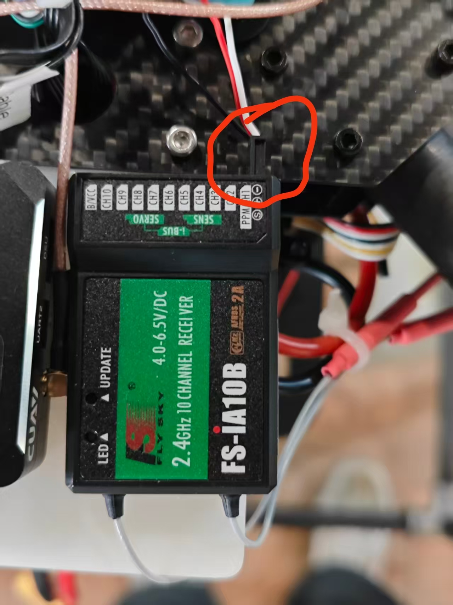
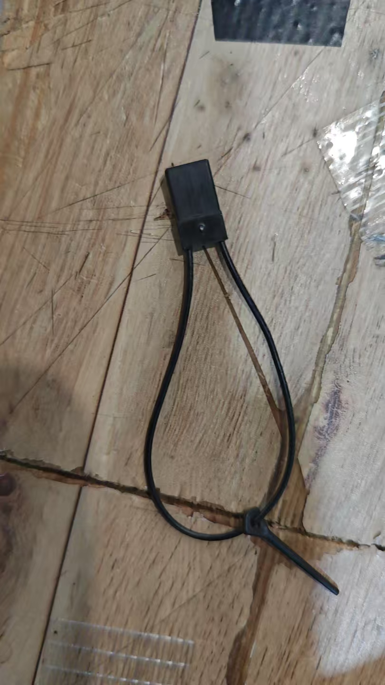
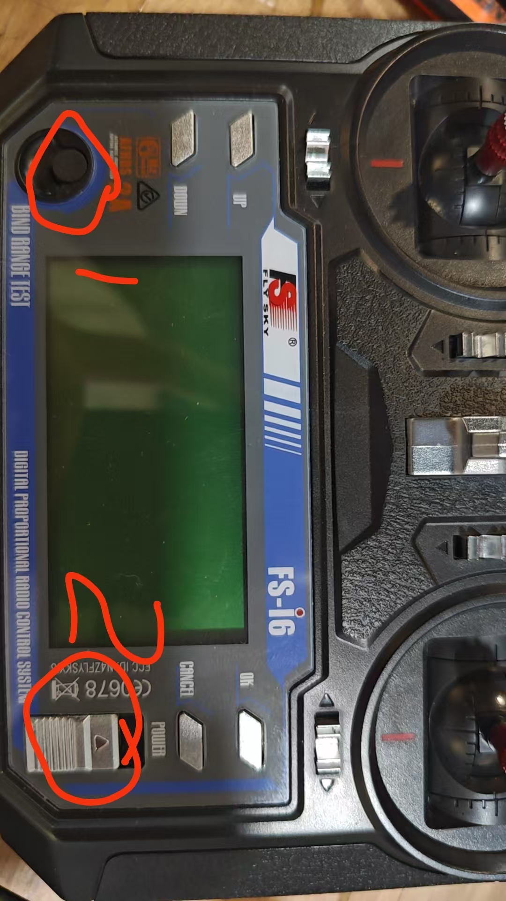

# 遥控器调频使用说明

## 一、适用范围

本文用于说明无人机遥控器与接收机之间的频段确认、配对和链路检查流程。不同品牌、型号的遥控器菜单名称可能不同，请以设备说明书为准。

## 二、调频前准备

- 确认遥控器、接收机和飞控供电正常，遥控器电量充足。
- 将无人机固定在安全位置，拆下螺旋桨或断开动力系统，防止误操作造成伤害。
- 确认周边没有正在使用相同频段的遥控设备，避免互相干扰。
- 记录当前遥控器的模型配置、接收机编号和原有频段设置，便于异常时恢复。

## 三、调频与配对步骤

本流程适用于图示的 FlySky FS-i6 遥控器和 FS-iA10B 接收机。

1. 拔掉接收机上图中红圈标出的三芯线。

   

2. 将对频线插入接收机的 `B/VCC` 接口。

   

3. 重新插上第 1 步拔掉的三芯线。接收机通电后，状态指示灯会持续闪烁，表示已进入对频模式。
4. 按住遥控器左侧的 `1` 黑色按钮不松开，同时使用右侧的 `2` 电源开关开启遥控器。

   

5. 持续按住左侧黑色按钮，直到接收机指示灯由闪烁变为常亮。此时对频完成。
6. 取下 `B/VCC` 接口上的对频线，确认接收机指示灯常亮且遥控器通道输入正常。

## 四、连接检查

- 观察接收机状态灯，确认链路处于正常连接状态。
- 在飞控地面站或遥控器通道监视页面检查各通道是否有输入。
- 缓慢拨动摇杆、模式开关和急停开关，确认通道方向、行程和功能正确。
- 保持无人机不解锁，进行近距离和远距离链路检查；信号质量下降、丢帧或失控保护异常时，应停止飞行并重新排查。

## 五、常见问题处理

| 现象 | 处理建议 |
| --- | --- |
| 无法完成配对 | 确认遥控器与接收机的制式兼容，并按正确顺序使接收机进入配对模式。 |
| 配对后没有通道输入 | 检查接收机与飞控之间的线序、协议类型和飞控端口配置。 |
| 信号不稳定 | 检查发射天线和接收天线安装方向，远离碳板、电源线、数传模块等干扰源。 |
| 飞行中触发失控保护 | 立即停止飞行，检查接收机供电、天线连接、信号质量及失控保护参数。 |

## 六、安全注意事项

- 未完成通道和失控保护检查前，不得安装螺旋桨或进行解锁飞行。
- 不得擅自使用当地法规不允许的频段、发射功率或信道。
- 每次更换遥控器、接收机、飞控配置或天线位置后，均应重新进行链路和失控保护检查。
